# How to Import Data from the Facebook Ads Source

Before proceeding, please make sure that:

- You have already created an **access token**, as described in [GETTING_STARTED.md](GETTING_STARTED.md).  
- You [have run **OWOX Data Marts**](https://docs.owox.com/docs/getting-started/quick-start/) and created at least one storage in the **Storages** section.  

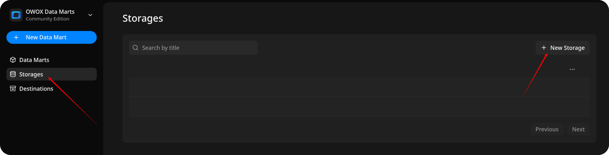

## Create the Data Mart

- Click **New Data Mart**.
- Enter a title and select the Storage.
- Click **Create Data Mart**.

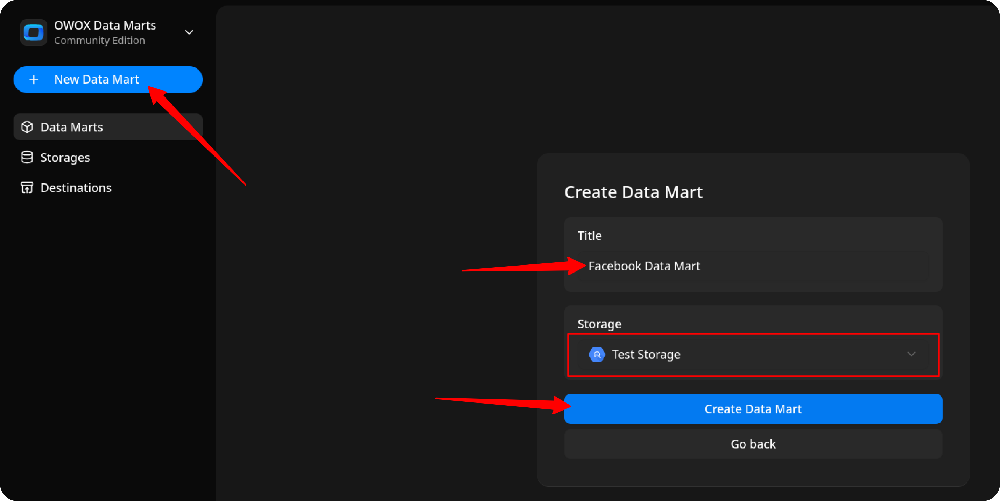

## Set Up the Connector

1. Select **Connector** as the input source type.
2. Click Set up connector and choose Facebook Ads.
3. Fill in the required fields:
    - **Access token** – paste the token you generated earlier.
    - **Account ID** – you can find it in **[Meta Ads Manager](https://adsmanager.facebook.com/adsmanager/manage/accounts) → Account Overview**.
    - Leave the other fields as default and proceed to the next step.

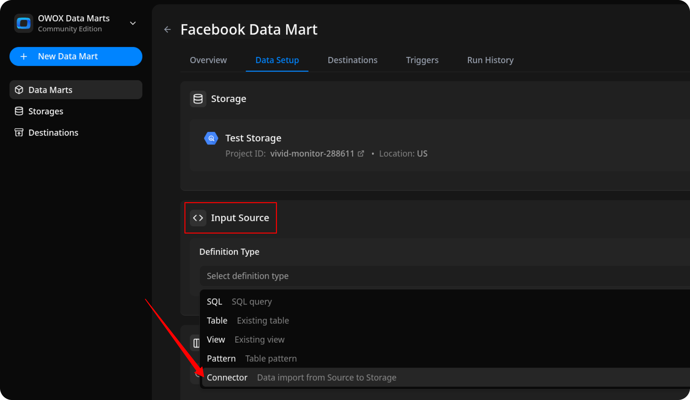

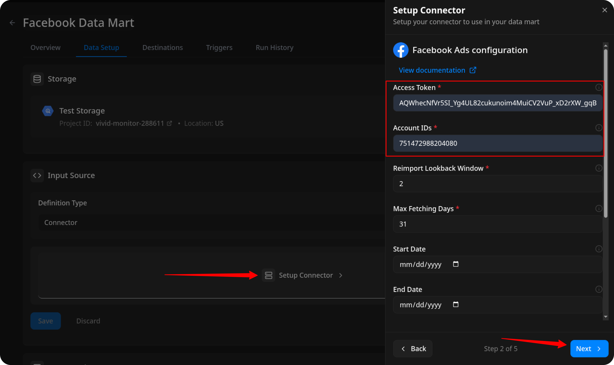

## Configure Data Import

1. Choose one of the available endpoints.
2. Select the required **fields**. If you want to import spend, clicks and impressions from ad account, please, choose [`ad-account/insights`](https://developers.facebook.com/docs/marketing-api/reference/ad-account/insights/) endpoint.
3. Specify the **dataset** where the data will be stored, or leave it as default.
4. Click **Finish**, then **Save and Publish Data Mart**.

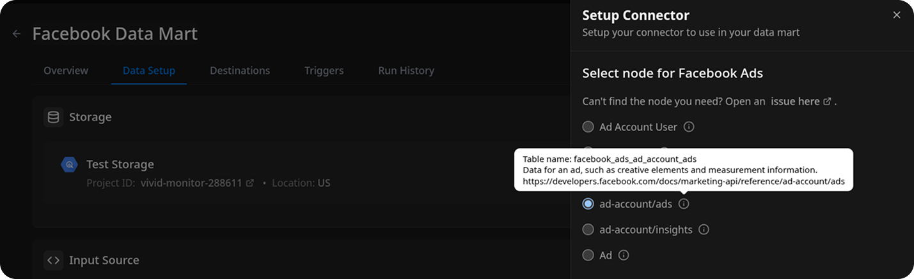

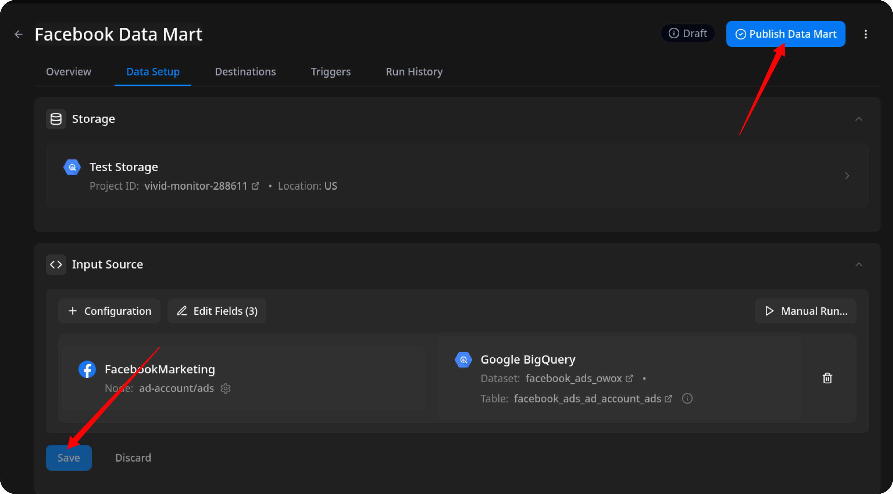

## Run the Data Mart

Now you have **two options** for importing data from Facebook Ads:

Option 1: Import Current Day's Data

Choose **Manual run → Incremental load** to load data for the **current day**.

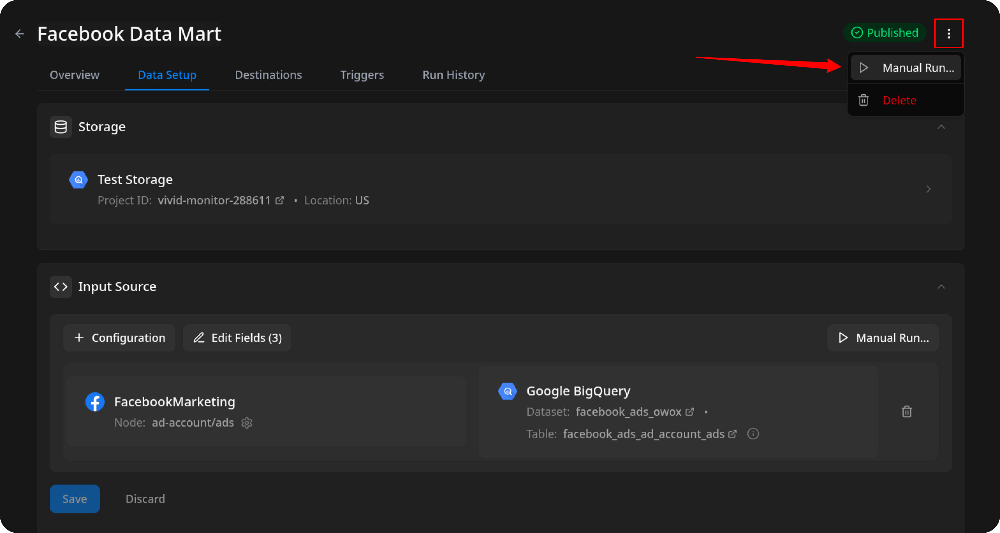

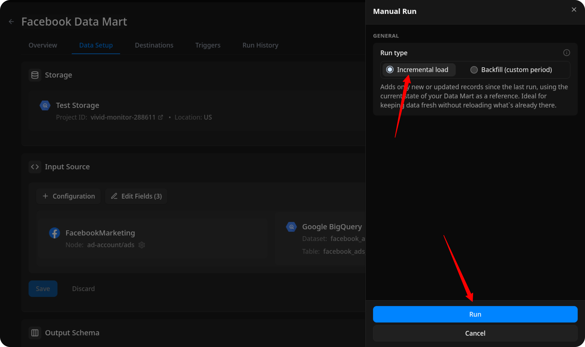

> ℹ️ If you click **Incremental load** again after a successful initial load,  
> the connector will import: **Current day's data**, plus **Additional days**, based on the value in the **Reimport Lookback Window** field.

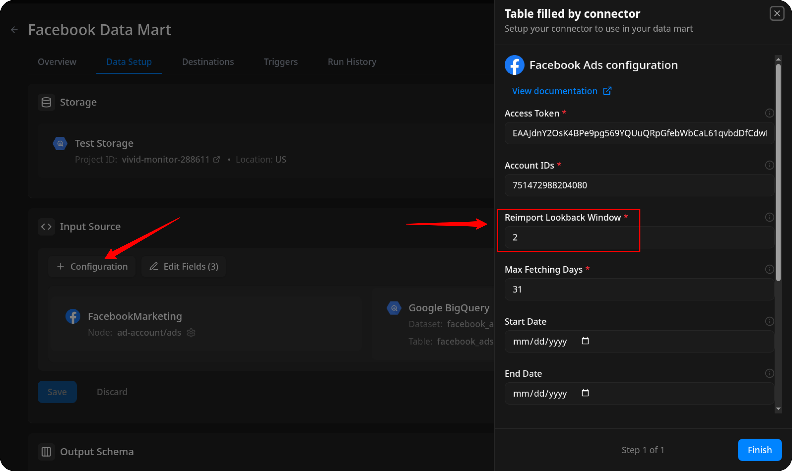

Option 2: Manual Backfill for Specific Date Range

Choose **Backfill (custom period)** to load historical data for a custom time range.

1. Select the **Start Date** and **End Date**  
2. Click the **Run** button

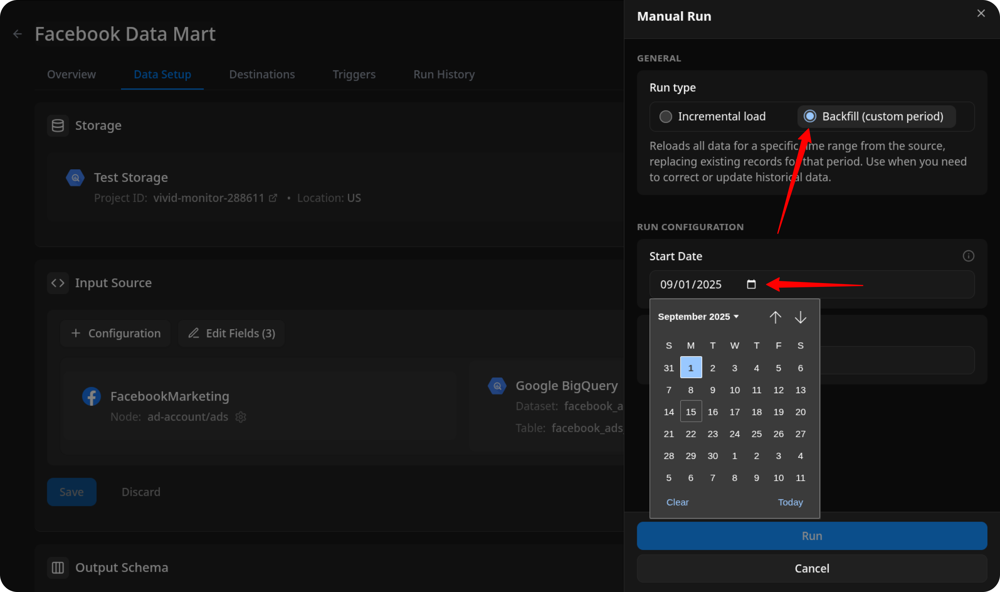

The process is complete when the **Run history** tab shows the message:  
**"Success"**  

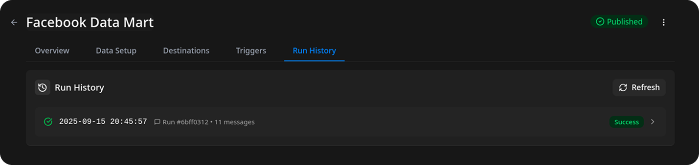

## Access Your Data

The data will be written to the dataset specified earlier.

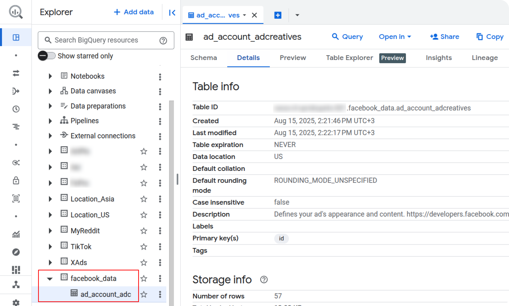

If you encounter any issues:

1. Check the Run history for specific error messages
2. Please [visit Q&A](https://github.com/OWOX/owox-data-marts/discussions/categories/q-a) first
3. If you want to report a bug, please [open an issue](https://github.com/OWOX/owox-data-marts/issues)
4. Join the [discussion forum](https://github.com/OWOX/owox-data-marts/discussions) to ask questions or propose improvements
