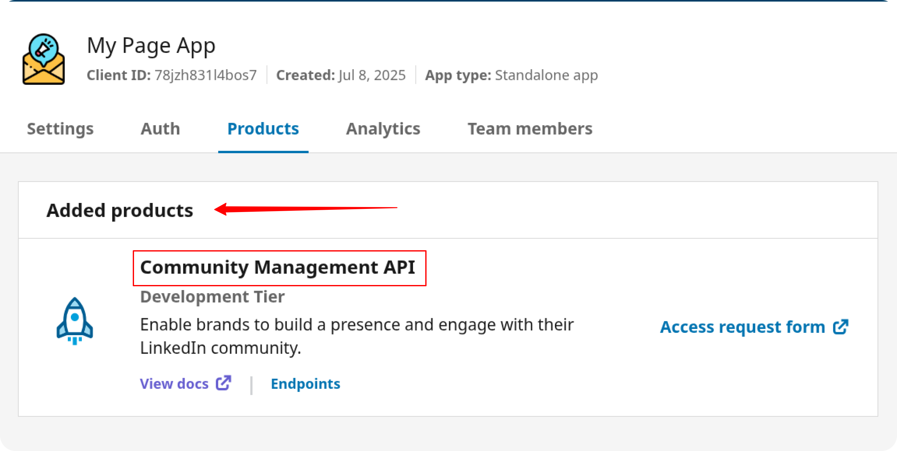
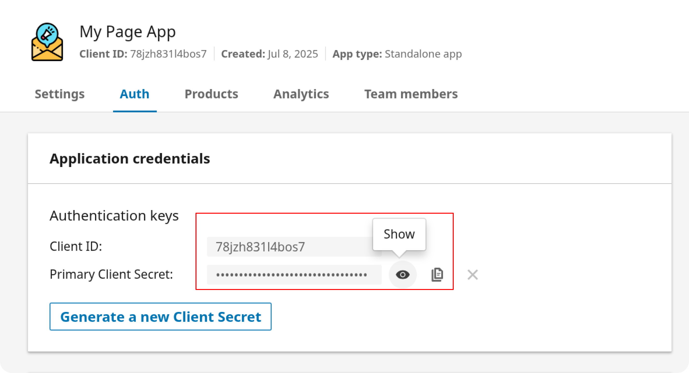
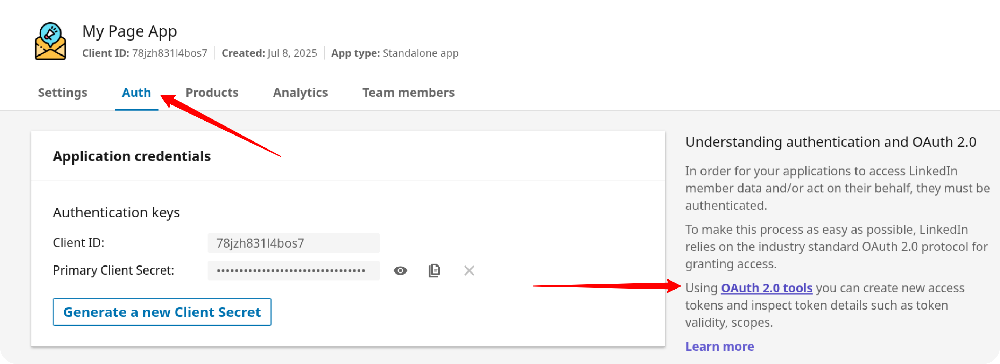
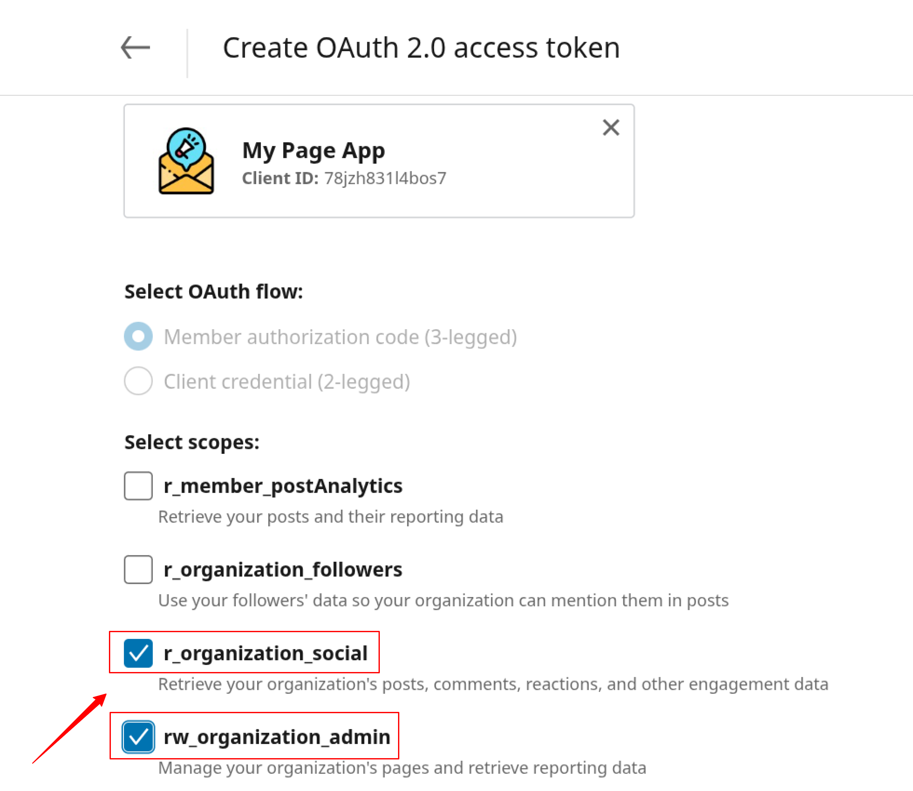
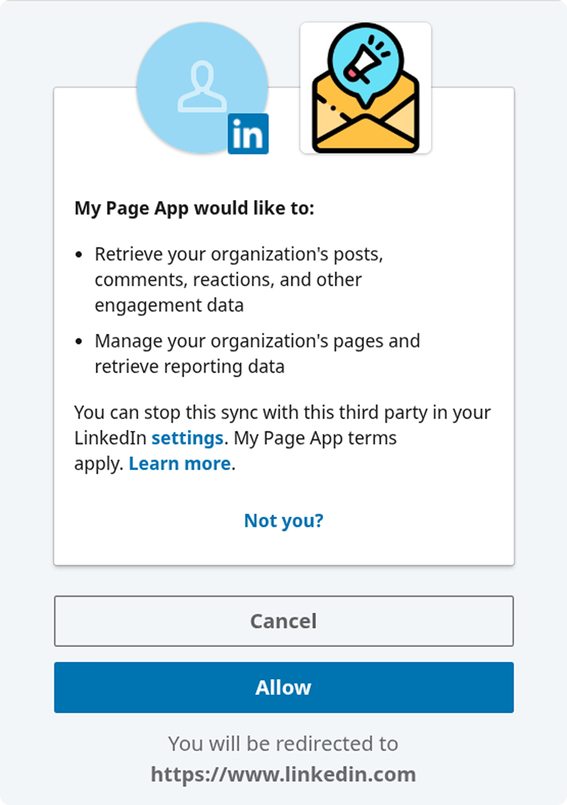
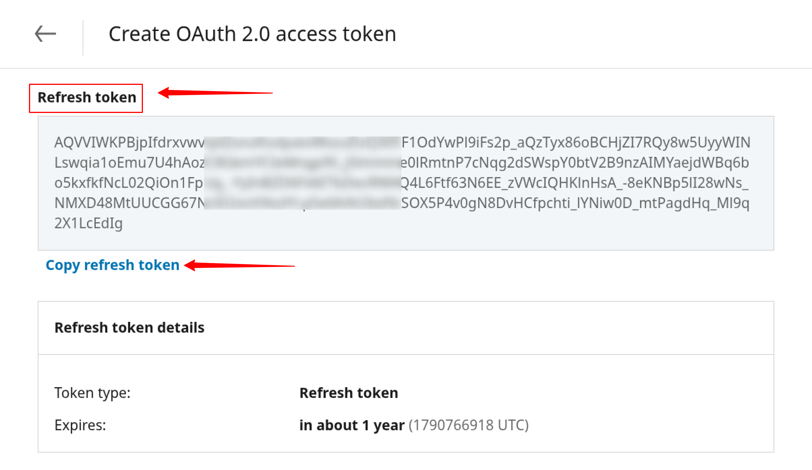

# How to obtain the Access Token for Linkedin Pages Sources

To connect to LinkedIn Pages through the API, you need to create an app, request access to the API, and generate a refresh token. Follow the steps below to complete the process.

## Step 1: Create a LinkedIn App

Visit the [LinkedIn Developer portal](https://developer.linkedin.com/).

Click the **Create App** button.

Enter your **App Name** and paste the link to your company's LinkedIn page into the **LinkedIn Page** field.  

 

Upload your app logo, check the box to accept the legal agreement, and click the **Create App** button.  

 

## Step 2: Verify the App

Go to the **Settings** tab and click the **Verify** button. Share the link with the administrator of your LinkedIn company page. The administrator must verify the app to grant it access to company data.  

 

 

 Please, ensure that the app is verified:

 

## Step 3: Request Access to the API

Once your app is verified, navigate to the **Products** tab and request access to the necessary APIs.

If you need access to **LinkedIn Page** data to work with organic content and page analytics — such as posts, followers, reactions, comments, shares, and engagement metrics — request access to **Community Management API**.

When access is granted, the **Community Management API** will appear under the **Added Products** section on the Products page.

## Step 4: Generate a Refresh Token

Navigate to the **Auth** tab of your LinkedIn app.

Copy the Client ID and Client Secret, you will need it later.

Click **OAuth 2.0 tools** on the right-hand side of the page.

Click the **Create token** button to begin the authorization process.

---

If you see the following error message:  
_"There aren't any scopes available for this app. Select another app or visit your app's product settings to request API access,"_  
make sure you've requested and received approval for the **Community Management API** in **Step 3**.

---

Select the required scopes for **pages data** access:

- `r_organization_social`  
- `rw_organization_admin`  

After selecting the appropriate scopes, click **Request access token**.

On the next screen, click **Allow** to authorize the app.

## Step 5: Save the Refresh Token

After the token is generated, **copy and securely store your Refresh Token**.

> ⚠️ **Important:**  
> Make sure you are copying the **Refresh Token**, not the **Access Token**.  
> The **Refresh Token** is located at the **bottom** of the page.

## ✅ You’re Ready to Go

You can now use this token as described in the [Getting Started guide](GETTING_STARTED.md) to connect to LinkedIn Pages data source.

## Troubleshooting and Support

If you encounter any issues:

1. Please [visit Q&A](https://github.com/OWOX/owox-data-marts/discussions/categories/q-a) first
2. If you want to report a bug, please [open an issue](https://github.com/OWOX/owox-data-marts/issues)
3. Join the [discussion forum](https://github.com/OWOX/owox-data-marts/discussions) to ask questions or propose improvements
