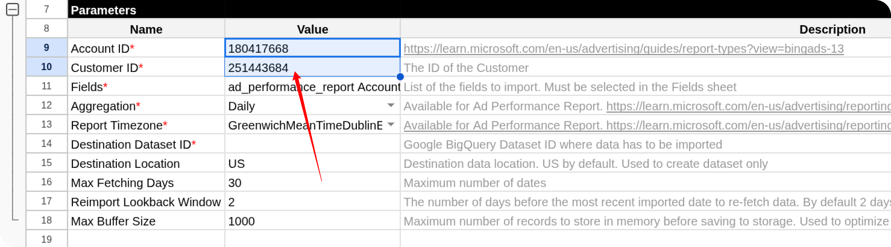
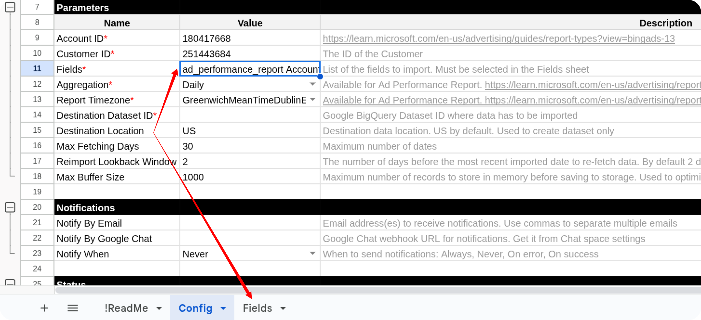
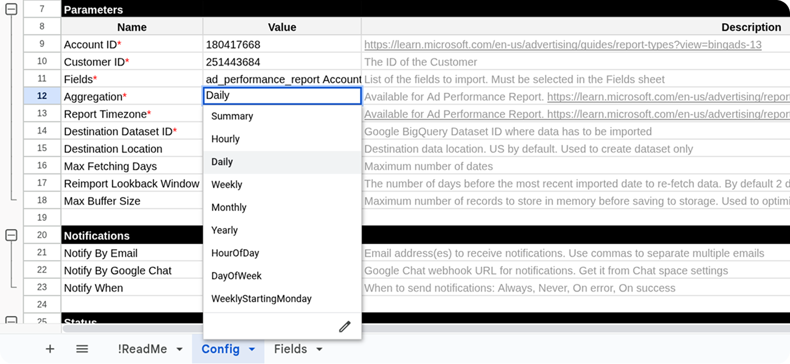
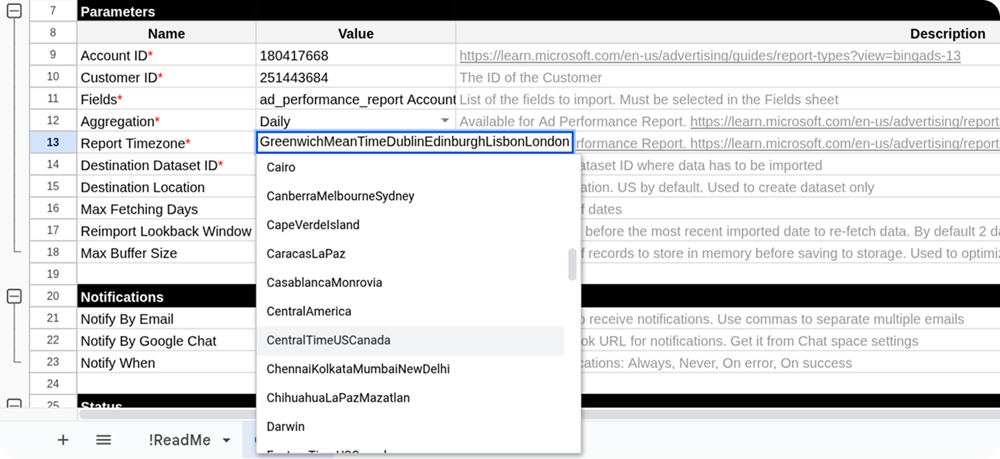
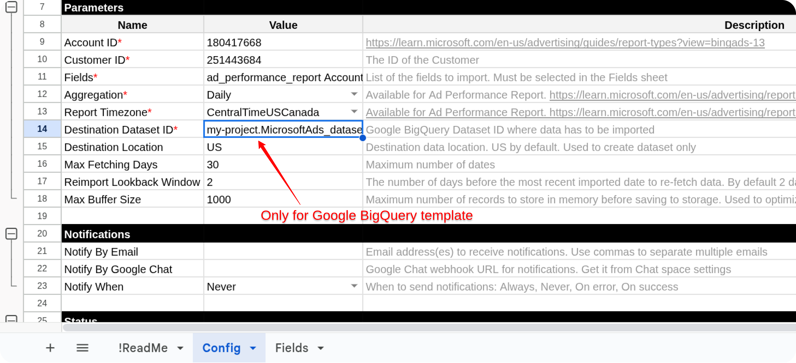
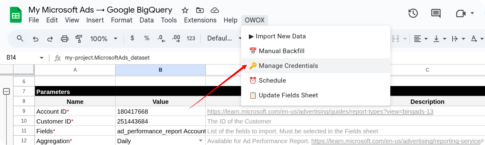

# How to Import Data from the Microsoft Ads Source

To begin importing data from Microsoft Ads, start by making a copy of one of the following templates:

- [**Microsoft Ads → Google Sheets. Template**](https://docs.google.com/spreadsheets/d/1OTLrSl1bMDC6IS8eKDYPEOx_LBZZI7kPePh2eTEeiEc/copy)
- [**Microsoft Ads → Google BigQuery. Template**](https://docs.google.com/spreadsheets/d/1uETkcB5Pq8oN3fed9eNxxdyaycLYJ7ZxRibU1CzuCdA/copy)

Fill in the required information:

- **Account ID**
- **Customer ID**
- **Fields**
- **Aggregation**
- **Report Timezone**
- **Destination Dataset ID** (for **Google BigQuery** template)
- **Destination Location** (for **Google BigQuery** template)

Log in to your Microsoft Ads account at [https://ads.microsoft.com/](https://ads.microsoft.com/).  
Your **Account ID** and **Customer ID** can be found in the account URL.

Copy and paste both values into the template.

Go to the **Fields** tab and check the boxes next to the fields you want to include.  

Select the **Report Aggregation** value.  
Refer to the [Microsoft Ads documentation](https://learn.microsoft.com/en-us/advertising/reporting-service/reportaggregation?view=bingads-13) to learn more.  

Choose the **Report Time Zone** to define the timezone for the reporting date range.

If you're using the **Google BigQuery** template, also provide:

- **Destination Dataset ID** in the format: `projectid.datasetid`
- **Destination Location**

> ℹ️ If the specified dataset doesn't exist, it will be created automatically.

Open the menu: **OWOX → Manage Credentials**

Enter your credentials obtained by following this guide: [**How to obtain the credentials for the Microsoft Ads source**](CREDENTIALS.md)

Now you have **two options** for importing data from Microsoft Ads:

Option 1: Import Current Day's Data

Choose **OWOX → Import New Data** to load data for the **current day**.

The import process is complete when the **Log** sheet displays:  
**"Import is finished"**  

Access Your Data:

- In the **Google Sheets** template, the data will appear in new tabs labeled with the corresponding data types.  

- In the **Google BigQuery** template, the data will be written to the dataset specified earlier.

To import more data:

1. Select the additional fields you need in the **Fields** tab.
2. Go to **OWOX → Import New Data** again.

If you encounter any issues:

1. Check the "Logs" sheet for specific error messages
2. Please [visit Q&A](https://github.com/OWOX/owox-data-marts/discussions/categories/q-a) first
3. If you want to report a bug, please [open an issue](https://github.com/OWOX/owox-data-marts/issues)
4. Join the [discussion forum](https://github.com/OWOX/owox-data-marts/discussions) to ask questions or propose improvements
