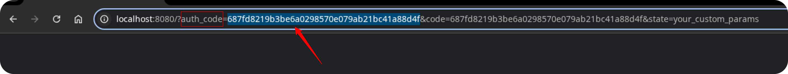

# How to obtain the Access Token for TikTok Ads Source

To connect to the TikTok Ads API and begin importing data, follow the steps below.

## Step 1. Create a Developer App

Follow these steps to register your application within the TikTok For Business developer portal:

1. **Access the Portal:** Navigate to the [TikTok for Business Developers portal](https://business-api.tiktok.com/portal).
2. **Log In:** Use your TikTok for Business account credentials to log in.
3. **Become a Developer:** Click the "Become a Developer" button.
4. **Fill in Application Details:** Provide the requested personal and company information:
    * First Name
    * Last Name
    * Communication Email
    * Type of your company
5. **Complete Application:** Click "Next" and follow the prompts to finalize your developer application.

## Step 2. Configure the App

Once your developer application is approved, proceed to configure your new app:

1. **Create an App:** Go to ["My Apps"](https://business-api.tiktok.com/portal/apps) and select "Create an App."
2. **Provide App Information:** Fill in the essential details for your application:
    * **App Name:** A clear and descriptive name for your application.
    * **App Description:** A detailed explanation of your app's purpose and how it utilizes TikTok's API.
        * **Example Description:** *"Company Name provides financial control for e-commerce businesses by accurately tracking advertising costs across various platforms. TikTok API access is crucial for pulling detailed cost data from TikTok advertising accounts, enabling seamless integration with the OWOX Data Mart connector. This API access is fundamental for automatic correlation of TikTok ad spend with sales performance data. Without it, precise ROI analysis and ad budget optimization on TikTok are limited, necessitating manual data entry and hindering real-time financial insights."*
    * **Advertiser Redirect URL:** This URL is where TikTok will redirect users after successful authentication. For testing or token generation, a placeholder like `http://localhost:8080` can be used.

3. **Select Scope of permissions:** Grant your app the necessary access by selecting the following scopes. Use the search bar or browse manually:
    * **Ad Account Management:**
        * `Ad Account Information -> Read Ad Account Information`
    * **Ads Management:**
        * `Campaign -> Read Campaigns`
        * `Ad Group -> Read Ad Groups`
        * `Ad -> Read Ads`
    * **Audience Management:**
        * `Read Custom Audiences`
    * **Reporting:** (Select all levels of reporting permissions)

4. **Submit for Approval:** Click "Submit" to send your app for review.

**App Approval Process:** App approval can take up to **7 business days**. If your initial submission is not approved, consider revising your app description for clarity and resubmitting. Upon approval, you will receive an email notification similar to the one shown below:

## Step 3. Generate an Access Token

After your app is approved, you can generate an access token:

1. **Obtain Authorization URL:** From your app's details page, copy the "Advertiser authorization URL" and paste it into your web browser.

1. **Retrieve `auth_code`:** After successfully authenticating your TikTok account, you will be redirected to the specified "Advertiser redirect URL". This URL will contain an `auth_code` as a query parameter.

To obtain an access token, send a `POST` request to the TikTok API in order to exchange the `auth_code` for an `access_token`.

* **Endpoint:**  
  `https://business-api.tiktok.com/open_api/v1.3/oauth2/access_token/`

* **Request body parameters:**  
  * `app_id` – your unique application ID (e.g., in the format `APPID`). You can find this above the URL in the previous step.  
  * `secret` – your application’s secret key. Located directly below the App ID.  
  * `auth_code` – the authorization code (`auth_code`) obtained from the redirect URL.  

* **Headers:**  
  * `Content-Type: application/json`

If the request is successful, the response will include:  

* An **access_token** – required to authorize future API calls.  
* A list of available **advertiser_ids** – representing TikTok Business accounts linked to the authorized app.  

## Step 4: Use the Access Token

Once you have the access token, you can begin using it as described in the [Getting Started guide](GETTING_STARTED.md).

## Troubleshooting and Support

If you encounter any issues:

1. Please [visit Q&A](https://github.com/OWOX/owox-data-marts/discussions/categories/q-a) first
2. If you want to report a bug, please [open an issue](https://github.com/OWOX/owox-data-marts/issues)
3. Join the [discussion forum](https://github.com/OWOX/owox-data-marts/discussions) to ask questions or propose improvements
