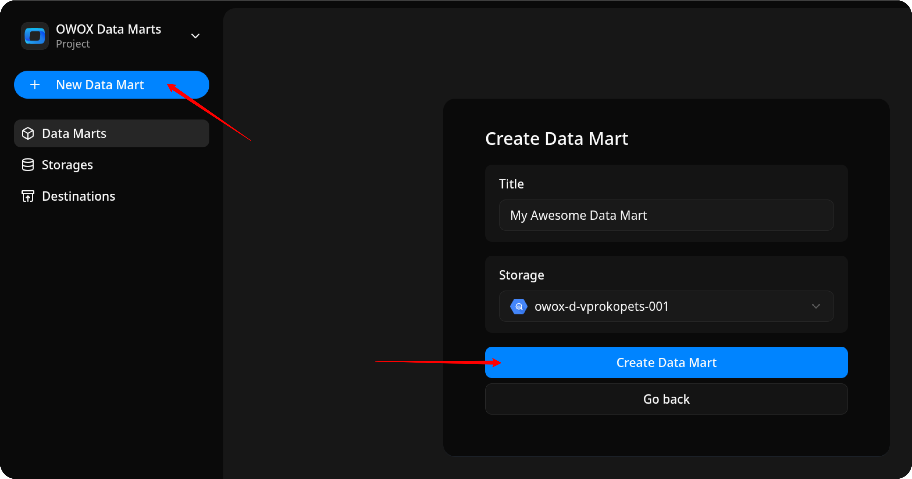
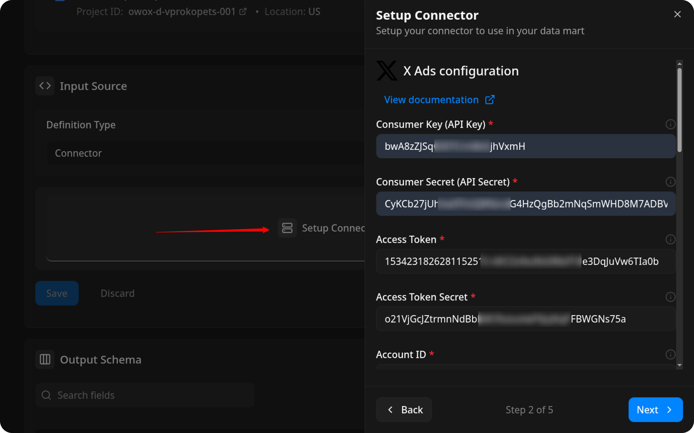
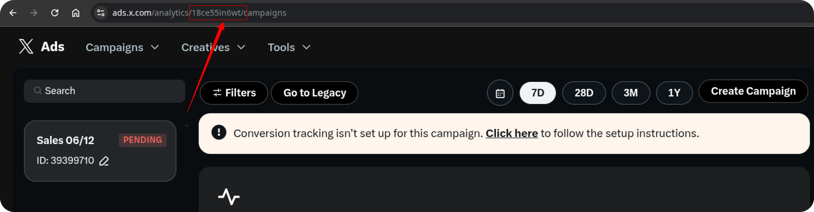
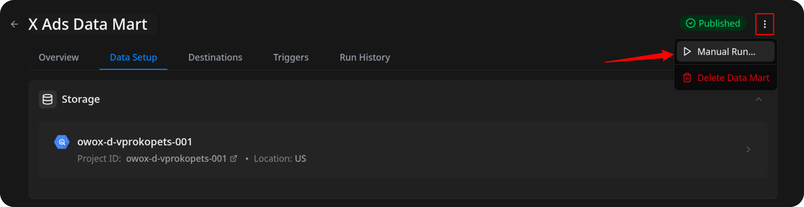
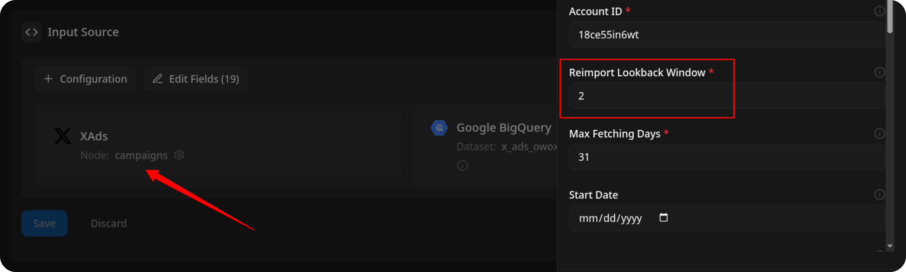
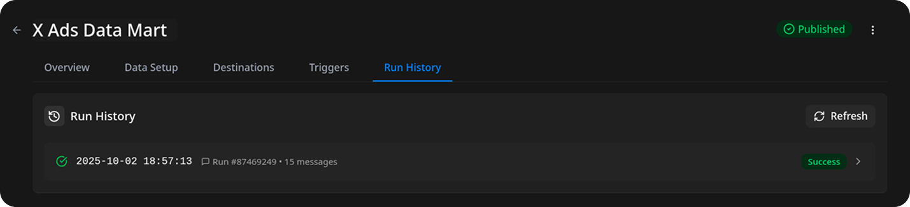

# How to Import Data from X Ads Source

Before proceeding, please make sure that:

- You have created a [CREDENTIALS](CREDENTIALS): API Key, API Secret, Access Token, Access Token Secret.  
- You have [set up **OWOX Data Marts**](https://docs.owox.com/docs/getting-started/quick-start/) and created at least one storage in the **Storages** section.

## Create the Data Mart

- Click **New Data Mart**.
- Enter a title and select the Storage.
- Click **Create Data Mart**.

## Set Up the Connector

1. Select **Connector** as the input source type.  
2. Click **Set up connector** and choose **X Ads**.  
3. Fill in the required fields:  
   - **Consumer Key (API Key)** and **Consumer Secret (API Secret)** – available in the **Consumer Keys** section of your X Ads app.  
   - **Access Token** and **Access Token Secret** – available in the **Authentication Tokens** section of your X Ads app.  
   - **Account ID** – you can get this ID on [https://ads.x.com](https://ads.x.com/) and look at the URL of your account. For example, in this link: `https://ads.x.com/campaign_form/18ce55in6wt/campaign/new` the **Account ID** is: `18ce55in6wt`
4. Leave all other fields as default and proceed to the next step.  

## Configure Data Import

1. Choose one of the available **endpoints**.  
2. Select the required **fields**.  
3. Specify the **dataset** where the data will be stored (or leave the default).  
4. Click **Finish**, then **Save** and **Publish Data Mart**.

## Run the Data Mart

You now have two options for importing data from X Ads:  

Option 1: Import Current Day's Data

Choose **Manual run → Incremental load** to load data for the **current day**.

> ℹ️ If you click **Incremental load** again after a successful initial load,  
> the connector will import: **Current day's data**, plus **Additional days**, based on the value in the **Reimport Lookback Window** field.

Option 2: Manual Backfill for Specific Date Range

Choose **Backfill (custom period)** to load historical data.  

1. Select the **Start Date** and **End Date**.
2. Click the **Run** button.

The process is complete when the **Run history** tab shows the message:  
**"Success"**  

## Access Your Data

Once the run is complete, the data will be written to the dataset you specified earlier.

If you encounter any issues:

1. Check the Run history for specific error messages
2. Please [visit Q&A](https://github.com/OWOX/owox-data-marts/discussions/categories/q-a) first
3. If you want to report a bug, please [open an issue](https://github.com/OWOX/owox-data-marts/issues)
4. Join the [discussion forum](https://github.com/OWOX/owox-data-marts/discussions) to ask questions or propose improvements
